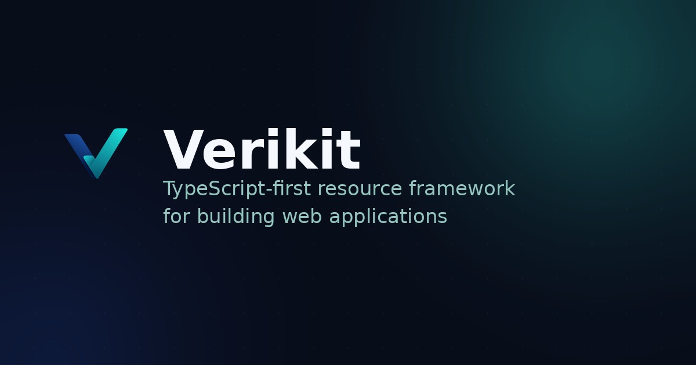

# Verikit



**Define a resource once, get the rest for free.** Verikit is a TypeScript framework for
CRUD-heavy apps: declare a resource's fields, validation, and permissions in one place, and derive
a REST API, a typed client, and ready-made table/form UI from it  instead of hand-writing the same
shape across your database, API, and frontend.

## Install

```sh
pnpm add @verikit/core @verikit/runtime
```

## Example

```ts
import { boolean, defineResource, text } from "@verikit/core";

const post = defineResource("post", {
  fields: {
    title: text().required(),
    published: boolean().default(false),
  },
});
```

That one definition is what `@verikit/server` exposes over REST, `@verikit/drizzle` backs with a
real database, `@verikit/client` calls from the browser, and `@verikit/react` renders as a table
and form.

## Docs

Guides and API reference: [verikit.dev](https://verikit.dev)

## Status

Verikit is under active development. APIs may change before a stable release.

---

Contributing? See [CONTRIBUTING.md](CONTRIBUTING.md) for local setup.
